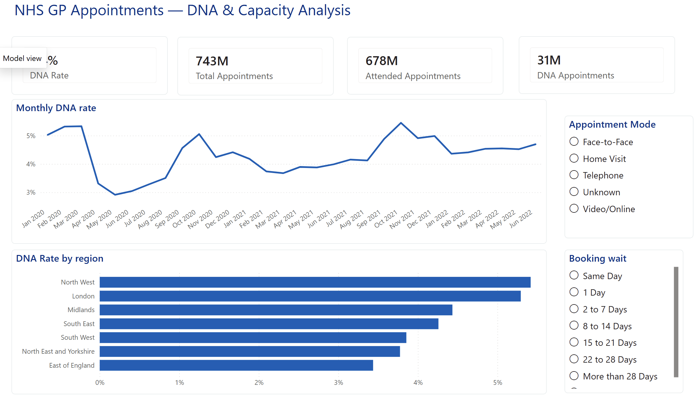
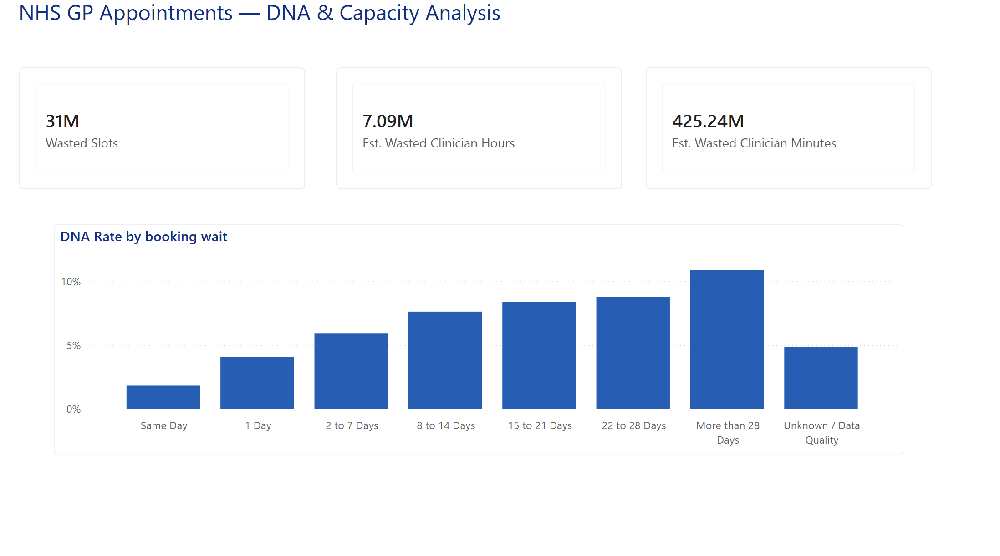
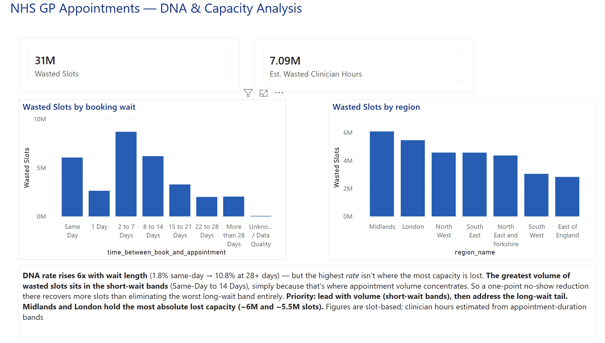

# NHS GP Appointments — DNA & Capacity Analysis

A Power BI dashboard that treats GP no-shows not as a statistic but as a
**capacity problem**: how much clinician time is lost to missed appointments,
what drives it, and where to target recovery. Built on NHS England's published
*Appointments in General Practice* data (Open Government Licence).

*Overview: the headline DNA rate, the volume of appointments behind it, and the
COVID-era shift in no-show behaviour.*

---

## The question

A "DNA" (Did Not Attend) is a booked GP slot that was funded, staffed, and
reserved — but produced no care. At scale, DNAs are a resource-allocation
problem: every one is a block of clinician time that can't be given back to the
waiting list. The dashboard answers three questions in sequence:

1. **How big is the problem?** — the rate, and the volume behind it.
2. **What drives it?** — which appointments get missed, and why.
3. **Where is the recoverable capacity?** — so effort can be targeted.

---

## Headline findings

- **31 million slots lost to no-shows** over 2.5 years (Jan 2020 – Jun 2022),
  out of 743M appointments — an overall **DNA rate of 4.4%**.
- That's an estimated **7.1 million hours of clinician time** (see the
  estimation note under *Limitations*).
- **DNA rate climbs ~6x with waiting time** — from 1.8% for same-day
  appointments to 10.8% for those booked more than 28 days ahead. A clean,
  monotonic relationship: the longer the wait, the more likely the no-show.
- **But the highest rate isn't where the most capacity is lost.** The greatest
  *volume* of wasted slots sits in the short-wait bands (same-day to 14 days),
  simply because that's where appointment volume concentrates. A one-point
  reduction there recovers more slots than eliminating the worst long-wait band
  entirely.
- **Regionally**, North West and London have the highest DNA *rates* (~5%),
  while Midlands and London hold the most *absolute* lost capacity (~6M and
  ~5.5M slots) — the distinction between rate and volume again.
- A clear **COVID signature**: the DNA rate fell sharply in April 2020 (~5.3%
  → ~2.9%) as appointments moved to telephone and online — you can't fail to
  show up to a phone call the way you skip an in-person visit — then recovered
  through 2021.

---

## The three pages

**1. Overview** — DNA rate, total/attended/missed appointments, the monthly
trend (with the COVID dip), and DNA rate by region. Slicers for appointment
mode and booking wait.

**2. What drives DNA?** — DNA rate by booking wait (the monotonic staircase
that proves the wait-time driver), by appointment mode, and by healthcare
professional type.

**3. Where's the lost capacity?** — wasted slots and estimated clinician hours,
broken down by booking wait and region, with the prioritised recommendation:
*lead with the high-volume short-wait bands, then address the long-wait tail.*

---

## How it's built

**Data model — a star schema.** Two fact tables (appointment counts by
status/mode/wait; appointment counts by actual duration) joined to three
dimensions: a geography lookup (ICB → region), a wait-band lookup, and a
duration-band lookup. Both facts share an ICB key and a common date table,
marked as such for time-intelligence.

**DAX measures** define the analysis rather than pre-computing it: DNA Rate
(deliberately excluding "Unknown" status from the denominator), the count
measures built on a single base measure, and the capacity estimates
(`Wasted Slots`, `Avg Appt Duration`, `Est. Wasted Clinician Hours`) that turn
missed appointments into a time figure via `SUMX` and `RELATED` across the
duration relationship.

**Power BI craft.** A custom NHS-branded theme (JSON), sort-by-column applied
to the wait and duration bands so they order logically rather than
alphabetically, and a consistent three-page layout with a shared header.

**A small Python prep step** (`prep_nhs.py`) builds the geography dimension and
the band-ordering lookups. It surfaced a genuine data-stewardship catch: the
period straddles the July 2022 ONS boundary refresh, so two regions (Midlands,
North East and Yorkshire) appear under *both* their old and new region codes —
consolidated here so each shows once.

---

## Limitations

Stated plainly, because the numbers are only as good as their caveats:

- **Capacity is quantified as slots and estimated as minutes, not measured.**
  The data gives appointment *counts* and *duration bands*, not the intended
  length of each missed appointment. Wasted hours apply the volume-weighted
  average attended-appointment duration (~13.7 minutes) as a proxy. The slot
  counts are exact; the hours are a defensible estimate.
- **No monetary figure.** Putting a £ value on lost capacity would need
  cost-per-appointment data that isn't in this dataset.
- **"Unknown" excluded** from the DNA rate denominator (Attended + DNA only),
  and "Unknown / Data Quality" bands shown but read separately.
- **Not all DNAs are preventable** — the wait-time and mode patterns identify
  the *addressable* share, not a claim that no-shows can be eliminated.

---

## Data

NHS England, *Appointments in General Practice* (regional/sub-ICB level),
January 2020 – June 2022. Published under the
[Open Government Licence](https://www.nationalarchives.gov.uk/doc/open-government-licence/).

---

*A DataWize Analytics portfolio project. Companion piece to
[Spend Ledger](https://github.com/Kojosafo86/spend-ledger), a natural-language
analytics tool over UK government spending — the two cover the BI/visualisation
and data-engineering sides of the same analytical craft.*
